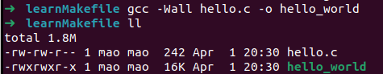

# gcc是什么
gcc全称GNU C Compiler或GNU Compiler Collection，既GNU上的C编译工具，除了可以用来编译C/C++语言，还支持编译Object-C。
# basic example
- 最基础的C代码 hello.c
```C
#include <stdio.h>

int main(void)
{
    printf("Hello world!\n");

    return 0;
}
```
- 执行下面的指令，编译这段代码
```bash
$ gcc -Wall hello.c -o hello_world
```
其中，`-W` 是warning， 和`all`搭配，表示显示所有的warning，
`-o`是output，将输出一个可执行文件，后面的`hello_world`是自定义的输出文件名，若不指定文件名，默认为`a.out`（在linux中）
可以看到生成了`hello_world`可执行文件


# 编译过程（compiling process）

# 重要参数